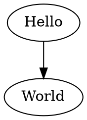
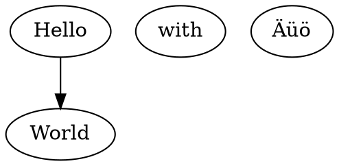

Use this


```
digraph G {Hello->World}
```

to get



with with Äüö



See [(this is a link to whatever)](#whatever) for an example with options `{.graphviz #whatever caption="this is the caption" width=35%}`:

```{.graphviz #whatever caption="this is the caption" width=35%}
digraph G {Hello->World}
```
